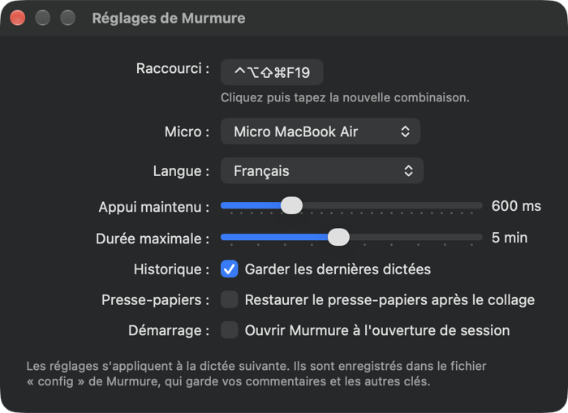

# Murmure

**Dictée vocale globale pour macOS, 100 % locale.**
Un raccourci, vous parlez, le texte s'écrit dans l'application active.


Pas de compte, pas d'abonnement, pas de clé API, aucune donnée qui sort de votre Mac
(la seule requête réseau lit le numéro de la dernière version publiée, voir
[Réseau](#réseau)).
Votre voix est transcrite par [whisper.cpp](https://github.com/ggerganov/whisper.cpp)
tournant en local.

## Pourquoi

Les outils de dictée pour Mac sont soit limités (la dictée système ponctue mal),
soit payants et connectés à un service distant. Murmure fait une seule chose :
il transforme votre voix en texte, partout, sans rien envoyer nulle part.

## Ce qu'il fait

- **Partout** — Mail, Slack, un terminal, un éditeur, un champ de recherche.
- **Local** — Whisper `large-v3-turbo` sur votre machine, hors ligne.
- **Rapide** — environ 2 secondes entre la fin de votre phrase et le texte collé.
- **Discret** — une icône dans la barre des menus, une pastille flottante pendant
  l'écoute, rien d'autre.
- **Corrigé** — un dictionnaire rattrape le vocabulaire technique que Whisper
  francise (« commis » → « commit », « worktrade » → « worktree »).


## Installation

Prérequis : macOS 14 ou plus, [Homebrew](https://brew.sh), et les outils en ligne de
commande Xcode (`xcode-select --install`).

```bash
git clone https://github.com/croustibat/murmure.git
cd murmure
./install.sh
```

L'installeur pose `ffmpeg` et `whisper-cpp`, télécharge le modèle (~550 Mo, une fois),
compile la pastille et l'app `~/Applications/Murmure.app`, puis la lance : son icône
apparaît dans la barre des menus.

Le menu signale une nouvelle version (« Version X.Y.Z disponible », qui ouvre la page
de la release). Pour mettre à jour, `git pull` puis `./install.sh` à nouveau. L'installeur ne remplace
que ce qui a changé et l'annonce en fin d'installation : tant que `Murmure.app` est
inchangée, elle n'est ni recréée ni re-signée et macOS conserve les autorisations.
Le modèle est vérifié par son empreinte SHA-256 ; un téléchargement interrompu reprend
au lancement suivant. `./install.sh --verify` recalcule l'empreinte d'un modèle déjà
présent et le retélécharge s'il est corrompu.

### Les deux autorisations

Au premier usage, macOS demande l'accès au **micro** : acceptez.

Pour que le texte se colle tout seul, ajoutez ensuite `Murmure.app` dans
**Réglages > Confidentialité et sécurité > Accessibilité**. Sans cela le texte
arrive dans le presse-papiers et vous faites ⌘V vous-même.

Murmure vérifie ces autorisations elle-même. Tant que l'Accessibilité manque (ou que
le micro est refusé), l'icône de la barre des menus porte un point d'exclamation et
le menu commence par « ⚠︎ Collage automatique désactivé — Autoriser… », qui ouvre
le bon panneau des Réglages ; au premier lancement concerné, une alerte explique la
marche à suivre. L'alerte du menu disparaît d'elle-même dès l'autorisation accordée.
Si le collage reste refusé malgré tout, le menu propose « Relancer Murmure ».

En venant d'une version où `Murmure.app` n'était qu'un lanceur (déclenché par
Karabiner), macOS redemande ces deux autorisations **une fois** : l'app est nouvelle
à ses yeux.

### Le raccourci

`Murmure.app` reste ouverte dans la barre des menus et gère elle-même le raccourci
global, **⌘⇧E** par défaut — et non ⌘E, qui priverait le Finder de « Éjecter ».
Aucun outil tiers n'est nécessaire, ni l'autorisation « Surveillance de l'entrée ».

Pour en changer, le plus simple est **Réglages…** dans le menu : cliquez le raccourci
puis tapez la nouvelle combinaison, appliquée aussitôt (sans ⌘, ⌃ ni ⌥, elle est
refusée ; déjà prise par une autre app, elle est signalée et l'ancienne conservée).
À la main, ajoutez une ligne `MURMURE_SHORTCUT` dans
`~/.local/share/murmure/config`, puis quittez et rouvrez Murmure :

```
MURMURE_SHORTCUT=ctrl+alt+d
```

Modificateurs : `cmd`, `shift`, `alt` (ou `option`), `ctrl` ; touche : une lettre ou
un chiffre (selon la disposition du clavier), `space`, `f1` à `f20`… Le menu affiche
le raccourci actif, et le journal signale une combinaison illisible ou refusée.

**Karabiner n'est plus nécessaire.** Si vous l'utilisiez pour Murmure, supprimez la
règle dans **Complex Modifications** (Remove) : sinon un appui démarrerait puis
arrêterait aussitôt la dictée. `./install.sh` signale une telle règle encore active.

Raycast, Karabiner ou tout autre outil peuvent toujours piloter Murmure :

```
/usr/bin/open -n -a ~/Applications/Murmure.app --args toggle
```

L'option `-n` est indispensable : elle lance une instance éphémère qui exécute la
commande puis s'arrête, sans toucher à l'instance de la barre des menus. Sans elle,
macOS se contente de réveiller l'app déjà ouverte et la commande est perdue.
Commandes : `toggle` (bascule), `press` à l'appui et `release` au relâchement
(maintenir pour parler), `cancel` pour annuler.

### Le menu

L'icône de la barre des menus change pendant l'écoute et la transcription. Son menu
donne l'état et le raccourci, démarre ou arrête une dictée, ouvre le journal, affiche
la version, et propose **Ouvrir au démarrage** pour lancer Murmure à l'ouverture de
session. **Rechercher les mises à jour…** interroge GitHub sur-le-champ ; quand une
version plus récente est publiée, l'entrée **Version X.Y.Z disponible** apparaît au-dessus
du numéro de version et ouvre la page de la release. Rien n'est téléchargé ni installé
automatiquement. Murmure ne garde aucun modèle en mémoire entre deux dictées.

**Dernières dictées** liste les 10 plus récentes, avec leur heure ; un clic copie le
texte dans le presse-papiers, pratique quand le collage a échoué ou pour réutiliser
une dictée. **Effacer l'historique** vide la liste. L'historique est gardé dans
`~/.local/share/murmure/historique.jsonl` (100 dictées au plus, les plus anciennes
supprimées) : il reste sur ce Mac et n'est jamais envoyé nulle part.
`MURMURE_HISTORY=0` dans le fichier `config` n'enregistre plus rien.

**Réglages…** (⌘,) ouvre une fenêtre pour le raccourci, le micro (par son nom, ou
celui du système), la langue, le seuil d'appui maintenu, la durée maximale,
l'historique, la restauration du presse-papiers et le lancement au démarrage. Elle
écrit dans le fichier `config` (voir plus bas) en ne touchant que la ligne du réglage
modifié : vos commentaires et les autres clés sont conservés.



## Utilisation

Deux modes, sans réglage :

- **Appui bref : bascule.** **⌘⇧E** démarre l'écoute — la pastille apparaît. Parlez.
  **⌘⇧E** à nouveau : le texte est transcrit puis collé.
- **Appui maintenu : parler.** Gardez **⌘⇧E** enfoncé le temps de parler ; le
  relâchement lance la transcription. Le seuil entre les deux est de 600 ms
  (`MURMURE_HOLD_MS`).

Vous pouvez aussi cliquer le carré de la pastille pour arrêter et transcrire.

**Annuler** une dictée ratée : **Échap** pendant l'écoute, ou le ✕ de la pastille.
L'enregistrement est jeté, rien n'est collé. Échap n'est intercepté que pendant
l'écoute : le reste du temps, il garde son rôle normal dans toutes les applications.

Le presse-papiers contient la dernière transcription : si le collage échoue, ⌘V la
récupère. Pour retrouver plutôt ce que vous aviez copié avant la dictée, activez
`MURMURE_RESTORE_CLIPBOARD` (voir ci-dessous).

## Configuration

Tout se règle dans `~/.local/share/murmure/` :

| Fichier | Rôle |
|---|---|
| `config` | réglages : langue, micro, durées… |
| `vocabulaire.txt` | termes soufflés à Whisper avant la transcription |
| `corrections.txt` | remplacements appliqués après, au format `entendu\|voulu` |

### Le fichier `config`

L'installeur le dépose avec toutes les clés en commentaire, à leur valeur par défaut,
et ne l'écrase jamais ensuite. Pour changer un réglage, retirez le `#` et modifiez la
valeur ; il s'applique à la dictée suivante, sans rien relancer :

```
MURMURE_LANG=en
MURMURE_DEVICE=MacBook Pro Microphone
MURMURE_HOLD_MS=800
```

Une ligne par réglage, `CLE=valeur`, sans guillemets (tolérés et retirés) ; `#` en
début de ligne pour commenter. Le fichier est lu, jamais exécuté : une clé inconnue,
une ligne malformée ou une valeur invalide (durée qui n'est pas un nombre, langue
autre qu'un code comme `fr` ou `auto`) est ignorée et signalée dans le journal.

| Clé | Défaut | Rôle |
|---|---|---|
| `MURMURE_LANG` | `fr` | langue de transcription |
| `MURMURE_DEVICE` | `:0` | micro : index ou nom (voir ci-dessous) |
| `MURMURE_MAX` | `300` | durée maximale d'un enregistrement, en secondes |
| `MURMURE_HOLD_MS` | `600` | au-delà, relâcher ⌘⇧E arrête l'écoute (appui maintenu) |
| `MURMURE_SILENCE_DB` | `-70` | seuil en dessous duquel l'audio est jugé muet |
| `MURMURE_WHISPER_ARGS` | _(vide)_ | options ajoutées à `whisper-cli`, par exemple `-bs 1 -bo 1` |
| `MURMURE_SHORTCUT` | `cmd+shift+e` | raccourci global, lu par `Murmure.app` à son lancement (voir « Le raccourci ») |
| `MURMURE_HISTORY` | `1` | `0` : les dictées ne sont plus enregistrées dans l'historique (voir « Le menu ») |
| `MURMURE_CHECK_UPDATES` | `1` | `0` coupe la vérification des nouvelles versions, lu par `Murmure.app` à son lancement (voir « Réseau ») |
| `MURMURE_RESTORE_CLIPBOARD` | `0` | `1` : remet le presse-papiers d'origine après le collage (voir ci-dessous) |

**Restaurer le presse-papiers.** Avec `MURMURE_RESTORE_CLIPBOARD=1`, Murmure
sauvegarde le presse-papiers juste avant de coller — ce que vous copiez pendant
l'écoute compte donc — puis le remet 0,4 s après le ⌘V. Tous les types sont
conservés : texte, texte mis en forme, images, fichiers copiés dans le Finder. Rien
n'est restauré, et la dictée reste au presse-papiers, quand :

- le collage a échoué (app cible quittée, autorisation Accessibilité absente) : c'est
  alors le seul moyen de la récupérer ;
- vous avez copié autre chose dans l'intervalle : votre copie prime ;
- le presse-papiers était vide, ou marqué confidentiel par un gestionnaire de mots de
  passe (le remettre empêcherait son effacement programmé) ;
- le contenu dépasse 64 Mo, ou macOS en refuse la lecture.

Limites : le contenu est lu en entier au moment du collage, ce qui peut le retarder
un peu pour une grosse image. Une fois restauré, il n'appartient plus à l'app
d'origine : les options qui en dépendent (collage spécial d'Office, par exemple)
peuvent disparaître. Au premier usage, macOS peut demander si Murmure a le droit de
lire le presse-papiers : sans cet accord, rien n'est restauré (réglable ensuite dans
**Réglages > Confidentialité et sécurité**).

À l'approche de `MURMURE_MAX` (30 dernières secondes, ou le dernier quart d'une
durée plus courte), la pastille affiche un compte à rebours ; à la limite, la
transcription part d'elle-même, comme sur un second appui.


**Le micro** se désigne par son index ou, plus sûrement, par son nom : l'index change
quand on branche un casque. La liste figure sous « AVFoundation audio devices » :

```bash
ffmpeg -f avfoundation -list_devices true -i ""
```

Le nom exact est cherché d'abord (casse ignorée), puis un nom qui le contient. S'il
n'est pas trouvé, Murmure prend le micro `:0` et le note dans le journal.
`MURMURE_DEVICE=:default` suit le micro choisi dans les réglages du système.

Une variable d'environnement du même nom l'emporte sur le fichier, pratique pour un
essai depuis le terminal : `MURMURE_LANG=en ~/.local/share/murmure/murmure.sh`.
Lancé par le raccourci, Murmure ne reçoit aucune variable : seul le fichier compte.

### Corrections

`corrections.txt` est l'outil efficace. Une règle par ligne, insensible à la casse,
sur mots entiers :

```
commis|commit
redit|Redis
worktrade|worktree
```

### Vitesse de transcription

Les options par défaut de `whisper-cli` sont conservées : sur une dictée courte,
l'encodeur traite toujours une fenêtre de 30 s et représente l'essentiel du temps.
Réduire cette fenêtre (`-ac`) fait répéter le texte à Whisper, et les autres options
(décodage glouton, `--no-fallback`, threads, VAD) gagnent moins de 10 % ou abîment
la transcription. Pour mesurer sur votre machine, avec vos propres enregistrements
(un `.txt` de référence à côté de chaque `.wav` active le calcul du taux d'erreur) :

```bash
scripts/bench.sh -n 5 dictee1.wav dictee2.wav
scripts/bench.sh -c 'défaut|' -c 'glouton|-bs 1 -bo 1' dictee1.wav
```

## Comment ça marche

```
⌘⇧E → Murmure.app (barre des menus) → murmure.sh
                      ├─ ffmpeg (avfoundation) ──→ WAV 16 kHz mono
                      ├─ overlay (AppKit) ───────→ pastille flottante
                      ├─ whisper-cli ────────────→ texte
                      ├─ corriger.pl ────────────→ vocabulaire rectifié
                      └─ pbcopy + ⌘V ───────────→ application active
```

Le bundle `.app` n'est pas cosmétique : un script nu n'a pas d'identité TCC, macOS ne
propose donc jamais l'autorisation micro et lui livre **un flux muet** au lieu d'une
erreur. Whisper, n'entendant rien, invente alors des génériques de sous-titres.

## Réseau

La transcription ne quitte jamais votre Mac. Murmure fait une seule requête réseau :
**au plus une fois par jour** (et quand vous choisissez « Rechercher les mises à
jour… »), l'app lit la dernière version publiée sur
`https://api.github.com/repos/croustibat/murmure/releases/latest`. C'est une simple
lecture d'une page publique : aucune donnée n'est envoyée, ni texte, ni audio, ni
identifiant. GitHub ne reçoit que ce que porte toute requête web : votre adresse IP, et
le numéro de version de Murmure dans l'en-tête `User-Agent`. Hors ligne ou
en cas d'erreur, rien ne s'affiche ; le journal en garde une ligne.

Pour la couper, ajoutez dans `~/.local/share/murmure/config`, puis quittez et rouvrez
Murmure :

```
MURMURE_CHECK_UPDATES=0
```

Plus aucune requête n'est faite et l'entrée « Rechercher les mises à jour… » disparaît.

## Dépannage

Le journal dit toujours ce qui s'est passé :

```bash
tail -20 /tmp/murmure-$(id -u)/murmure.log
```

La sortie technique de `whisper-cli` n'y figure que lorsqu'il échoue. Au-delà
d'environ 1 Mo, le journal est renommé `murmure.log.1` et repart de zéro.

| Symptôme | Cause probable |
|---|---|
| « Aucun son capté » | autorisation micro refusée, ou mauvais `MURMURE_DEVICE` |
| Texte copié mais pas collé, notification « Autorise Murmure dans Réglages > Accessibilité » | autorisation Accessibilité absente ou périmée (`n'est pas autorisé à envoyer de saisies. (1002)` dans le journal) : dans la liste Accessibilité, supprimez l'entrée Murmure (–), même cochée, puis rajoutez-la (+) |
| Texte copié mais pas collé, sans cette notification | l'app cible n'a pas repris le premier plan, ou a été quittée : le journal le dit |
| Accents cassés (`Soci√©t√©`) | locale non UTF-8 dans l'environnement du raccourci |
| Première dictée très lente | chargement du modèle et des shaders Metal ; les suivantes sont rapides |
| ⌘⇧E démarre puis arrête aussitôt, ou lance autre chose | une règle Karabiner encore active : `./install.sh` la signale, retirez-la dans Complex Modifications |
| ⌘⇧E ne fait rien | Murmure n'est pas ouverte (icône absente) ou le raccourci est pris : le menu et le journal l'indiquent |
| Autorisations à redonner après une mise à jour | `Murmure.app` a changé (l'installeur l'indique) : macOS voit une nouvelle signature, l'ancienne entrée Accessibilité reste cochée mais ne vaut plus. Supprimez-la (–) puis rajoutez-la |
| « ⚠︎ Collage refusé par macOS — Relancer Murmure » dans le menu | l'autorisation est accordée mais pas encore prise en compte : choisissez cette entrée |
| Erreur de modèle au lancement de Whisper | fichier abîmé : `./install.sh --verify` |

## Désinstallation

```bash
./uninstall.sh
```

Le script quitte Murmure, retire le lancement au démarrage, l'app, le modèle et les
fichiers de `~/.local/share/murmure`.

## Contribuer

La publication d'une version (fichier `VERSION`, étiquette, GitHub Release) est décrite
dans [CONTRIBUTING.md](CONTRIBUTING.md).

## Licence

MIT — voir [LICENSE](LICENSE).
