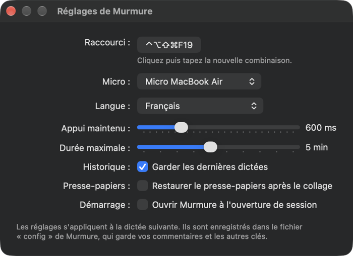

# Murmure

**Dictée vocale globale pour macOS, 100 % locale.**
Un raccourci, vous parlez, le texte s'écrit dans l'application active.

**[Télécharger pour Mac](https://github.com/croustibat/murmure/releases/latest/download/Murmure.dmg)**
(macOS 14+, Apple Silicon, gratuit) · [Installation](#installation) · [English](#english)


Pas de compte, pas d'abonnement, pas de clé API, aucune donnée qui sort de votre Mac
(deux requêtes réseau seulement : le téléchargement unique du modèle et la vérification
des mises à jour, voir [Réseau](#réseau)).
Votre voix est transcrite par [whisper.cpp](https://github.com/ggerganov/whisper.cpp)
tournant en local.

## Pourquoi

Les outils de dictée pour Mac sont soit limités (la dictée système ponctue mal),
soit payants et connectés à un service distant. Murmure fait une seule chose :
il transforme votre voix en texte, partout, sans rien envoyer nulle part.

## Ce qu'il fait

- **Partout** — Mail, Slack, un terminal, un éditeur, un champ de recherche.
- **Local** — Whisper `large-v3-turbo` sur votre machine, hors ligne.
- **Rapide** — environ 2 secondes entre la fin de votre phrase et le texte collé.
- **Discret** — une icône dans la barre des menus, une pastille flottante pendant
  l'écoute, rien d'autre.
- **Corrigé** — un dictionnaire rattrape le vocabulaire technique que Whisper
  francise (« commis » → « commit », « worktrade » → « worktree »).


## Installation

Il faut un Mac Apple Silicon (M1 ou plus récent) sous macOS 14 ou plus.

### Télécharger l'app

1. Téléchargez **[Murmure.dmg](https://github.com/croustibat/murmure/releases/latest/download/Murmure.dmg)**.
2. Ouvrez-le, glissez **Murmure** dans **Applications**, puis lancez-la depuis le dossier
   Applications : son icône apparaît dans la barre des menus.
3. Au premier lancement, Murmure propose de télécharger son modèle de transcription
   (~550 Mo, une seule fois, vérifié par son empreinte SHA-256).

L'app est signée et notarisée par Apple : elle s'ouvre sans avertissement. Elle
embarque tout ce qu'il lui faut (whisper.cpp, l'enregistreur, la pastille) : ni
Homebrew, ni Xcode, ni outil en ligne de commande.

### Avec Homebrew

```bash
brew install --cask croustibat/tap/murmure
```

C'est la même app que celle du DMG ; elle se met à jour toute seule, de la même façon.

### Mises à jour

Murmure regarde une fois par jour si une nouvelle version est publiée et propose de
l'installer en un clic (**Rechercher les mises à jour…** dans le menu le fait
sur-le-champ, voir [Réseau](#réseau)). Réglages, vocabulaire, corrections, historique
et modèle sont conservés, ainsi que les autorisations.

**Depuis la version 1.1.0 ou une plus ancienne** (installée avec `./install.sh`), il
n'y a pas de mise à jour automatique : quittez Murmure (menu > **Quitter Murmure**),
téléchargez [Murmure.dmg](https://github.com/croustibat/murmure/releases/latest/download/Murmure.dmg)
et glissez l'app dans Applications en remplaçant l'ancienne. Vos réglages, votre
vocabulaire, vos corrections, votre historique et le modèle sont conservés : ils sont
dans `~/.local/share/murmure`, que l'app reprend tel quel. L'ancienne app avait été
compilée sur votre Mac : macOS redemande une fois le micro et l'Accessibilité (voir
plus bas). Les copies de l'ancien moteur dans `~/.local/share/murmure` disparaissent
d'elles-mêmes après la première dictée.

### Depuis les sources

Pour compiler Murmure vous-même : il faut [Xcode](https://apps.apple.com/app/xcode/id497799835)
(ouvert une fois), CMake et XcodeGen, que l'installeur pose avec
[Homebrew](https://brew.sh) s'ils manquent.

```bash
git clone https://github.com/croustibat/murmure.git
cd murmure
./install.sh
```

L'installeur télécharge le modèle (~550 Mo, une fois), compile `whisper-cli`
(whisper.cpp) et l'app `/Applications/Murmure.app`, qui l'embarque, puis la lance.
S'il trouve à cette place l'app du DMG (ou de Homebrew), il le signale et demande
avant de la remplacer.

Pour mettre à jour, `git pull` puis `./install.sh` à nouveau. L'installeur ne remplace
que ce qui a changé et l'annonce en fin d'installation : tant que `Murmure.app` est
inchangée, elle n'est ni recréée ni re-signée et macOS conserve les autorisations.
Le modèle est vérifié par son empreinte SHA-256 ; un téléchargement interrompu reprend
au lancement suivant. `./install.sh --verify` recalcule l'empreinte d'un modèle déjà
présent et le retélécharge s'il est corrompu. Une app compilée ainsi reçoit aussi les
mises à jour automatiques, qui la remplacent par la version publiée ;
`MURMURE_CHECK_UPDATES=0` (voir [Réseau](#réseau)) l'en empêche.

### Les deux autorisations

Au premier usage, macOS demande l'accès au **micro** : acceptez.

Pour que le texte se colle tout seul, ajoutez ensuite `Murmure.app` dans
**Réglages > Confidentialité et sécurité > Accessibilité**. Sans cela le texte
arrive dans le presse-papiers et vous faites ⌘V vous-même.

Murmure vérifie ces autorisations elle-même. Tant que l'Accessibilité manque (ou que
le micro est refusé), l'icône de la barre des menus porte un point d'exclamation et
le menu commence par « ⚠︎ Collage automatique désactivé — Autoriser… », qui ouvre
le bon panneau des Réglages ; une alerte explique la marche à suivre (au premier
lancement, une fois le modèle téléchargé). L'alerte du menu disparaît d'elle-même dès
l'autorisation accordée. Si le collage reste refusé malgré tout, le menu propose
« Relancer Murmure ».

macOS rattache ces autorisations à la signature de l'app. Celle du DMG et de Homebrew
est signée par un certificat Developer ID : ses mises à jour gardent les autorisations.
En passant d'une copie compilée sur votre Mac à celle du DMG (ou l'inverse), macOS
redemande les deux autorisations **une fois**. L'ancienne entrée Accessibilité reste
cochée mais ne vaut plus : sélectionnez-la, supprimez-la (–), puis rajoutez Murmure
(+).

Depuis les sources, si le trousseau contient un certificat de développeur Apple
(« Developer ID Application », sinon « Apple Development »), `install.sh` signe
`Murmure.app` avec : macOS la reconnaît alors à son identifiant et à votre équipe, et
les autorisations survivent aux recompilations. Sans certificat, l'app est signée ad
hoc, reconnue à l'empreinte de son binaire : chaque recompilation oblige à redonner
l'Accessibilité (voir Dépannage). `MURMURE_SIGN_IDENTITY` choisit un certificat (nom,
équipe ou empreinte SHA-1) ; `MURMURE_SIGN_IDENTITY=-` force la signature ad hoc.

### Le raccourci

`Murmure.app` reste ouverte dans la barre des menus et gère elle-même le raccourci
global, **⌘⇧E** par défaut — et non ⌘E, qui priverait le Finder de « Éjecter ».
Aucun outil tiers n'est nécessaire, ni l'autorisation « Surveillance de l'entrée ».

Pour en changer, le plus simple est **Réglages…** dans le menu : cliquez le raccourci
puis tapez la nouvelle combinaison, appliquée aussitôt (sans ⌘, ⌃ ni ⌥, elle est
refusée ; déjà prise par une autre app, elle est signalée et l'ancienne conservée).
À la main, ajoutez une ligne `MURMURE_SHORTCUT` dans
`~/.local/share/murmure/config`, puis quittez et rouvrez Murmure :

```
MURMURE_SHORTCUT=ctrl+alt+d
```

Modificateurs : `cmd`, `shift`, `alt` (ou `option`), `ctrl` ; touche : une lettre ou
un chiffre (selon la disposition du clavier), `space`, `f1` à `f20`… Le menu affiche
le raccourci actif, et le journal signale une combinaison illisible ou refusée.

**Karabiner n'est plus nécessaire.** Si vous l'utilisiez pour Murmure, supprimez la
règle dans **Complex Modifications** (Remove) : sinon un appui démarrerait puis
arrêterait aussitôt la dictée. `./install.sh` signale une telle règle encore active.

Raycast, Karabiner ou tout autre outil peuvent toujours piloter Murmure :

```
/usr/bin/open -n -a /Applications/Murmure.app --args toggle
```

L'option `-n` est indispensable : elle lance une instance éphémère qui exécute la
commande puis s'arrête, sans toucher à l'instance de la barre des menus. Sans elle,
macOS se contente de réveiller l'app déjà ouverte et la commande est perdue.
Commandes : `toggle` (bascule), `press` à l'appui et `release` au relâchement
(maintenir pour parler), `cancel` pour annuler.

### Le menu

L'icône de la barre des menus change pendant l'écoute et la transcription. Son menu
donne l'état et le raccourci, démarre ou arrête une dictée, ouvre le journal, affiche
la version, et propose **Ouvrir au démarrage** pour lancer Murmure à l'ouverture de
session. **Rechercher les mises à jour…** interroge GitHub sur-le-champ (Murmure le
fait aussi seule, une fois par jour) ; une version plus récente s'installe en un clic,
puis Murmure redémarre. Jamais au milieu d'une dictée : l'installation attend la fin de
la transcription, et une version trouvée pendant une dictée est signalée par l'entrée
**Version X.Y.Z disponible…** plutôt que par une fenêtre. Murmure ne garde aucun modèle
en mémoire entre deux dictées.

**Dernières dictées** liste les 10 plus récentes, avec leur heure ; un clic copie le
texte dans le presse-papiers, pratique quand le collage a échoué ou pour réutiliser
une dictée. **Effacer l'historique** vide la liste. L'historique est gardé dans
`~/.local/share/murmure/historique.jsonl` (100 dictées au plus, les plus anciennes
supprimées) : il reste sur ce Mac et n'est jamais envoyé nulle part.
`MURMURE_HISTORY=0` dans le fichier `config` n'enregistre plus rien.

**Réglages…** (⌘,) ouvre une fenêtre pour le raccourci, le micro (par son nom, ou
celui du système), la langue, le seuil d'appui maintenu, la durée maximale,
l'historique, la restauration du presse-papiers et le lancement au démarrage. Elle
écrit dans le fichier `config` (voir plus bas) en ne touchant que la ligne du réglage
modifié : vos commentaires et les autres clés sont conservés.



## Utilisation

Deux modes, sans réglage :

- **Appui bref : bascule.** **⌘⇧E** démarre l'écoute — la pastille apparaît. Parlez.
  **⌘⇧E** à nouveau : le texte est transcrit puis collé.
- **Appui maintenu : parler.** Gardez **⌘⇧E** enfoncé le temps de parler ; le
  relâchement lance la transcription. Le seuil entre les deux est de 600 ms
  (`MURMURE_HOLD_MS`).

Vous pouvez aussi cliquer le carré de la pastille pour arrêter et transcrire.

**Annuler** une dictée ratée : **Échap** pendant l'écoute, ou le ✕ de la pastille.
L'enregistrement est jeté, rien n'est collé. Échap n'est intercepté que pendant
l'écoute : le reste du temps, il garde son rôle normal dans toutes les applications.

Le presse-papiers contient la dernière transcription : si le collage échoue, ⌘V la
récupère. Pour retrouver plutôt ce que vous aviez copié avant la dictée, activez
`MURMURE_RESTORE_CLIPBOARD` (voir ci-dessous).

## Configuration

Tout se règle dans `~/.local/share/murmure/` :

| Fichier | Rôle |
|---|---|
| `config` | réglages : langue, micro, durées… |
| `vocabulaire.txt` | termes soufflés à Whisper avant la transcription |
| `corrections.txt` | remplacements appliqués après, au format `entendu\|voulu` |

Le vocabulaire est un court texte, pas une liste exhaustive : Whisper le relit
avant chaque tranche de 30 s et il partage 224 tokens avec la fin de la tranche
précédente. Au-delà d'environ 150 tokens (≈ 500 caractères), les longues dictées
perdent le fil d'une tranche à l'autre. Mieux vaut y garder les noms propres et le
jargon que Whisper écorche, et laisser les mots courants au dictionnaire de
corrections.

### Le fichier `config`

Murmure le dépose au premier lancement avec toutes les clés en commentaire, à leur
valeur par défaut, et ne l'écrase jamais ensuite. Pour changer un réglage, retirez le `#` et modifiez la
valeur ; il s'applique à la dictée suivante, sans rien relancer :

```
MURMURE_LANG=en
MURMURE_DEVICE=MacBook Pro Microphone
MURMURE_HOLD_MS=800
```

Une ligne par réglage, `CLE=valeur`, sans guillemets (tolérés et retirés) ; `#` en
début de ligne pour commenter. Le fichier est lu, jamais exécuté : une clé inconnue,
une ligne malformée ou une valeur invalide (durée qui n'est pas un nombre, langue
autre qu'un code comme `fr` ou `auto`) est ignorée et signalée dans le journal.

| Clé | Défaut | Rôle |
|---|---|---|
| `MURMURE_LANG` | `fr` | langue de transcription |
| `MURMURE_DEVICE` | `:0` | micro : index ou nom (voir ci-dessous) |
| `MURMURE_MAX` | `300` | durée maximale d'un enregistrement, en secondes |
| `MURMURE_HOLD_MS` | `600` | au-delà, relâcher ⌘⇧E arrête l'écoute (appui maintenu) |
| `MURMURE_SILENCE_DB` | `-70` | seuil en dessous duquel l'audio est jugé muet |
| `MURMURE_WHISPER_ARGS` | _(vide)_ | options ajoutées à `whisper-cli`, par exemple `-bs 1 -bo 1` |
| `MURMURE_WHISPER` | _(celui de l'app)_ | chemin absolu d'un autre `whisper-cli`, par exemple une autre version |
| `MURMURE_SHORTCUT` | `cmd+shift+e` | raccourci global, lu par `Murmure.app` à son lancement (voir « Le raccourci ») |
| `MURMURE_HISTORY` | `1` | `0` : les dictées ne sont plus enregistrées dans l'historique (voir « Le menu ») |
| `MURMURE_CHECK_UPDATES` | `1` | `0` coupe la vérification des nouvelles versions, lu par `Murmure.app` à son lancement (voir « Réseau ») |
| `MURMURE_RESTORE_CLIPBOARD` | `0` | `1` : remet le presse-papiers d'origine après le collage (voir ci-dessous) |

**Restaurer le presse-papiers.** Avec `MURMURE_RESTORE_CLIPBOARD=1`, Murmure
sauvegarde le presse-papiers juste avant de coller — ce que vous copiez pendant
l'écoute compte donc — puis le remet 0,4 s après le ⌘V. Tous les types sont
conservés : texte, texte mis en forme, images, fichiers copiés dans le Finder. Rien
n'est restauré, et la dictée reste au presse-papiers, quand :

- le collage a échoué (app cible quittée, autorisation Accessibilité absente) : c'est
  alors le seul moyen de la récupérer ;
- vous avez copié autre chose dans l'intervalle : votre copie prime ;
- le presse-papiers était vide, ou marqué confidentiel par un gestionnaire de mots de
  passe (le remettre empêcherait son effacement programmé) ;
- le contenu dépasse 64 Mo, ou macOS en refuse la lecture.

Limites : le contenu est lu en entier au moment du collage, ce qui peut le retarder
un peu pour une grosse image. Une fois restauré, il n'appartient plus à l'app
d'origine : les options qui en dépendent (collage spécial d'Office, par exemple)
peuvent disparaître. Au premier usage, macOS peut demander si Murmure a le droit de
lire le presse-papiers : sans cet accord, rien n'est restauré (réglable ensuite dans
**Réglages > Confidentialité et sécurité**).

À l'approche de `MURMURE_MAX` (30 dernières secondes, ou le dernier quart d'une
durée plus courte), la pastille affiche un compte à rebours ; à la limite, la
transcription part d'elle-même, comme sur un second appui.


**Le micro** se désigne par son index ou, plus sûrement, par son nom : l'index change
quand on branche un casque. La fenêtre **Réglages…** les propose ; la liste, dans
l'ordre des index (`:0`, `:1`…), s'obtient aussi avec l'enregistreur de l'app :

```bash
/Applications/Murmure.app/Contents/Helpers/murmure-rec --list-devices
```

Le nom exact est cherché d'abord (casse ignorée), puis un nom qui le contient. S'il
n'est pas trouvé, Murmure prend le micro par défaut du système et le note dans le
journal. `MURMURE_DEVICE=:default` suit le micro choisi dans les réglages du système.

Une variable d'environnement du même nom l'emporte sur le fichier, pratique pour un
essai depuis le terminal : `MURMURE_LANG=en /Applications/Murmure.app/Contents/Resources/engine/murmure.sh`.
Lancé par le raccourci, Murmure ne reçoit aucune variable : seul le fichier compte.

### Corrections

`corrections.txt` est l'outil efficace. Une règle par ligne, insensible à la casse,
sur mots entiers :

```
commis|commit
redit|Redis
worktrade|worktree
```

### Vitesse de transcription

Les options par défaut de `whisper-cli` sont conservées : sur une dictée courte,
l'encodeur traite toujours une fenêtre de 30 s et représente l'essentiel du temps.
Réduire cette fenêtre (`-ac`) fait répéter le texte à Whisper, et les autres options
(décodage glouton, `--no-fallback`, threads, VAD) gagnent moins de 10 % ou abîment
la transcription. Pour mesurer sur votre machine, avec vos propres enregistrements
(un `.txt` de référence à côté de chaque `.wav` active le calcul du taux d'erreur) :

```bash
scripts/bench.sh -n 5 dictee1.wav dictee2.wav
scripts/bench.sh -c 'défaut|' -c 'glouton|-bs 1 -bo 1' dictee1.wav
```

`-b` compare plusieurs binaires `whisper-cli`, par exemple celui que compile
`scripts/build-whisper.sh` et celui de Homebrew ; la colonne « même texte » dit si
chacun rend exactement la transcription de la première ligne :

```bash
scripts/bench.sh -c 'défaut|' -b 'embarqué|build/whisper/whisper-cli' \
  -b 'Homebrew|/opt/homebrew/bin/whisper-cli' dictee1.wav dictee2.wav
```

## Comment ça marche

```
⌘⇧E → Murmure.app (barre des menus) → murmure.sh
                      ├─ murmure-rec (Core Audio) → WAV 16 kHz mono
                      ├─ overlay (AppKit) ───────→ pastille flottante
                      ├─ whisper-cli ────────────→ texte
                      ├─ corriger.pl ────────────→ vocabulaire rectifié
                      └─ pbcopy + ⌘V ───────────→ application active
```

`murmure.sh`, `corriger.pl` et les outils vivent dans `Murmure.app` : une mise à jour de
l'app met le moteur à jour. `~/.local/share/murmure` ne garde que vos données (réglages,
vocabulaire, corrections, modèle, historique).

Le bundle `.app` n'est pas cosmétique : un script nu n'a pas d'identité TCC, macOS ne
propose donc jamais l'autorisation micro et lui livre **un flux muet** au lieu d'une
erreur. Whisper, n'entendant rien, invente alors des génériques de sous-titres.

## Réseau

La transcription ne quitte jamais votre Mac. Murmure fait exactement deux requêtes
réseau.

**Le modèle, une seule fois** : au premier lancement, l'app télécharge
`ggml-large-v3-turbo-q5_0.bin` (~550 Mo) depuis une révision figée du dépôt Hugging Face
`ggerganov/whisper.cpp`, puis vérifie son empreinte SHA-256. Rien n'est envoyé ; une fois
le modèle en place, plus aucune requête n'est nécessaire pour dicter.

**Les mises à jour, au plus une fois par jour** (et quand vous choisissez « Rechercher les
mises à jour… ») : l'app lit la liste des versions publiées,
`https://github.com/croustibat/murmure/releases/latest/download/appcast.xml`, avec
[Sparkle](https://sparkle-project.org). C'est une simple lecture d'un fichier public :
aucune donnée n'est envoyée, ni texte, ni audio, ni identifiant, ni profil de votre Mac
(`SUEnableSystemProfiling` est désactivé). GitHub ne reçoit que ce que porte toute
requête web : votre adresse IP, votre langue, et les numéros de version de Murmure et
de Sparkle dans l'en-tête `User-Agent`. Si vous acceptez une nouvelle version, l'app la
télécharge depuis la même release GitHub. Hors ligne ou en cas d'erreur, rien ne
s'affiche ; le journal en garde une ligne.

Pour la couper, ajoutez dans `~/.local/share/murmure/config`, puis quittez et rouvrez
Murmure :

```
MURMURE_CHECK_UPDATES=0
```

Plus aucune requête n'est faite et l'entrée « Rechercher les mises à jour… » disparaît.

## Dépannage

Le journal dit toujours ce qui s'est passé :

```bash
tail -20 /tmp/murmure-$(id -u)/murmure.log
```

La sortie technique de `whisper-cli` n'y figure que lorsqu'il échoue. Au-delà
d'environ 1 Mo, le journal est renommé `murmure.log.1` et repart de zéro.

| Symptôme | Cause probable |
|---|---|
| « Aucun son capté » | autorisation micro refusée, ou mauvais `MURMURE_DEVICE` |
| Texte copié mais pas collé, notification « Autorise Murmure dans Réglages > Accessibilité » | autorisation Accessibilité absente ou périmée (`n'est pas autorisé à envoyer de saisies. (1002)` dans le journal) : dans la liste Accessibilité, supprimez l'entrée Murmure (–), même cochée, puis rajoutez-la (+) |
| Texte copié mais pas collé, sans cette notification | l'app cible n'a pas repris le premier plan, ou a été quittée : le journal le dit |
| Accents cassés (`Soci√©t√©`) | locale non UTF-8 dans l'environnement du raccourci |
| Première dictée très lente | après l'installation ou une mise à jour, Murmure prépare `whisper-cli` (« Préparation… » dans le menu, moins d'une minute) : une dictée lancée avant la fin attend la compilation des shaders Metal. Les suivantes sont rapides |
| ⌘⇧E démarre puis arrête aussitôt, ou lance autre chose | une règle Karabiner encore active : `./install.sh` la signale, retirez-la dans Complex Modifications |
| ⌘⇧E ne fait rien | Murmure n'est pas ouverte (icône absente) ou le raccourci est pris : le menu et le journal l'indiquent |
| Autorisations à redonner après une mise à jour | l'identité de `Murmure.app` a changé : passage d'une copie compilée sur ce Mac (1.1.0, `./install.sh`) à l'app du DMG ou l'inverse, signature ad hoc recompilée, ou passage à un certificat. L'ancienne entrée Accessibilité reste cochée mais ne vaut plus : supprimez-la (–) puis rajoutez-la. Avec un certificat, cela n'arrive qu'une fois |
| Le Finder refuse de remplacer `Murmure.app` | l'app est ouverte : quittez-la depuis son menu (**Quitter Murmure**), puis recommencez |
| « ⚠︎ Collage refusé par macOS — Relancer Murmure » dans le menu | l'autorisation est accordée mais pas encore prise en compte : choisissez cette entrée |
| Erreur de modèle au lancement de Whisper | fichier abîmé : supprimez `~/.local/share/murmure/.modele-verifie` puis relancez Murmure, qui revérifie le modèle et propose de le retélécharger (depuis les sources : `./install.sh --verify`) |

## Désinstallation

**App du DMG** : décochez **Ouvrir au démarrage** dans le menu, quittez Murmure, puis
mettez `Murmure.app` à la corbeille. Vos données restent dans `~/.local/share/murmure`
(réglages, vocabulaire, corrections, historique, modèle) : supprimez ce dossier pour
tout effacer.

**Homebrew** : `brew uninstall --cask murmure`, ou `brew uninstall --zap --cask murmure`
pour retirer aussi les données et les réglages.

**Depuis les sources** :

```bash
./uninstall.sh
```

Le script quitte Murmure, retire le lancement au démarrage, l'app (celle du DMG
comprise), les caches et réglages des mises à jour, puis demande s'il faut aussi
supprimer vos données de `~/.local/share/murmure`, modèle compris.

Dans tous les cas, retirez ensuite l'entrée Murmure de la liste Accessibilité.

## Contribuer

La publication d'une version (fichier `VERSION`, étiquette, GitHub Release) est décrite
dans [CONTRIBUTING.md](CONTRIBUTING.md).

L'icône de l'app (`app/Murmure.icns`, versionnée) et ses déclinaisons pour le site
(`site/public/`) se régénèrent avec `swift scripts/icone.swift`, sans autre outil.

## Licence

MIT — voir [LICENSE](LICENSE).

## English

**Murmure is fully local, system-wide voice dictation for macOS.** Press a shortcut,
speak, and the text is pasted into the app you're using. Your voice is transcribed by
[whisper.cpp](https://github.com/ggerganov/whisper.cpp) (Whisper `large-v3-turbo`) on
your Mac, offline: no account, no subscription, no API key, nothing sent anywhere. The
app's interface is in French; dictation works in French by default, and in English or
any Whisper language from **Réglages…** (Settings) or `MURMURE_LANG=en`.

### Install

Requires an Apple Silicon Mac (M1 or later) running macOS 14 or later.

- **Download [Murmure.dmg](https://github.com/croustibat/murmure/releases/latest/download/Murmure.dmg)**,
  open it and drag **Murmure** to **Applications**. The app is signed and notarized
  by Apple and bundles everything it needs: no Homebrew, no Xcode. On first launch it
  offers to download its transcription model (~550 MB, once, checked against its
  SHA-256 hash).
- **Or with Homebrew**: `brew install --cask croustibat/tap/murmure` (same app).
- **Or from source**: Xcode, CMake and XcodeGen (installed with Homebrew if missing),
  then `git clone https://github.com/croustibat/murmure.git && cd murmure && ./install.sh`.

Murmure lives in the menu bar. Dictate with **⌘⇧E**: press, talk, press again — or
hold the keys while you talk. **Esc** cancels. Two permissions are needed:
**Microphone** (macOS asks on first use) and **Accessibility** (System Settings >
Privacy & Security > Accessibility), so the text can be pasted for you. Until then,
the menu shows what's missing and opens the right pane.

### Updates

Murmure checks for a new version once a day and installs it in one click, with
[Sparkle](https://sparkle-project.org). Your settings, vocabulary, corrections,
history and model are kept, and so are the permissions.

Coming from version 1.1.0 or earlier (installed with `./install.sh`)? Those don't
update themselves: quit Murmure, download Murmure.dmg and drag the app to
Applications, replacing the old one. Everything in `~/.local/share/murmure` is kept.
Since the old app was built on your Mac, macOS asks once more for the microphone and
Accessibility: in the Accessibility list, remove the old Murmure entry (–), even if
it's checked, then add Murmure again (+).

### Network

Transcription never leaves your Mac. Murmure makes exactly two kinds of requests: the
one-time model download from Hugging Face, and, at most once a day, reading
`appcast.xml` from this repository's latest GitHub release to check for updates (an
update you accept is downloaded from that same release). No text, audio, identifier or
system profile is sent. `MURMURE_CHECK_UPDATES=0` in
`~/.local/share/murmure/config` turns update checks off.

### Uninstall

DMG: quit Murmure and move it to the Trash; delete `~/.local/share/murmure` to remove
your data and the model. Homebrew: `brew uninstall --zap --cask murmure`. From source:
`./uninstall.sh`. Then remove Murmure from the Accessibility list.

Everything else (configuration, vocabulary, corrections, troubleshooting) is
documented in French above. MIT license.
